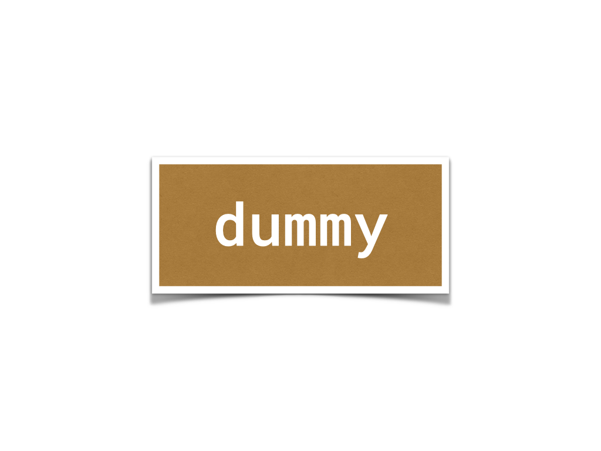

#+OPTIONS: ^:{}
#+STARTUP: indent nolineimages overview num
#+TITLE: d1_init キックオフ
#+AUTHOR: Shigeto R. Nishitani
#+EMAIL:     (concat "shigeto_nishitani@mac.com")
#+LANGUAGE:  jp
#+OPTIONS:   H:4 toc:t num:2
#+HTML_HEAD: <link rel="stylesheet" type="text/css" href="style_w_link_button.css" />
#+MACRO: dummy_link @@html:<a href="#">$1</a>@@

# for style.css, never move from here
[[../symbolic_math.html][up_button]]
[[../d2_log/readme.html][next_button]]
# for a real link rewrite usual [[\url][]]

| 

| date          | 提出課題(nbviewer)        | 参考資料 | 宿題                            |
|---------------+---------------------------+----------+---------------------------------|
| d1_0925_intro | [[file:10_before_materials/pair_agreement.docx][ペア同意書]]                |          | python,                         |
|               | LUNAで案内したOneDrive内の =c1_install=，=c2_python= |          | jupyter notebookをBYODにinstall |
| d1_0925       | [[file:20_day_materials/20_pair.ipynb][20年度ペア試験]] |          | [[file:../d2_log/first_leaf.ipynb][first_leaf]]                      |

- 「ペア同意書」は来週提出してください．
- 来週までにfirst_leafをやってきてください．
  - 提出は来週の課題とともに1チーム一つです．
